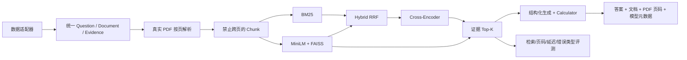

# EvalRAG：可评测、可解释的多领域 RAG

这是一个面向算法工程岗位展示的 RAG 项目，不以堆功能为目标，而是回答三个
可以被实验验证的问题：**检索到了什么、答案依据是什么、系统为什么失败**。

项目使用两条互补实验线：

- [HotpotQA](https://huggingface.co/datasets/hotpotqa/hotpot_qa)：验证多跳证据检索，公平比较 BM25、Dense、Hybrid RRF 和 Cross-Encoder。
- [FinanceBench](https://huggingface.co/datasets/PatronusAI/financebench)：在真实财报 PDF 上验证文档检索、页码级证据、数值问答和引用追踪。

## 当前结论

截至 2026-08-08，HotpotQA 检索实验和 FinanceBench 真实 PDF 检索实验已经完成；
FinanceBench API 答案评测尚待 API Key，医疗 QLoRA 重训位于独立仓库且尚待
24GB GPU。文档只报告已经运行得到的数字。

### HotpotQA：算法验证

固定使用前 100 条 validation 样本，按 Seed 42 划分 20 Dev / 80 Test。
RRF 参数只在 Dev 选择，Test 只用于最终报告。

| 系统 | Hit@1 | Recall@5 | Complete@5 | Recall@10 | Complete@10 | MRR |
|---|---:|---:|---:|---:|---:|---:|
| BM25 | 0.8000 | 0.7165 | 0.4375 | 0.8258 | 0.6375 | 0.8748 |
| Dense FAISS | 0.7750 | 0.6965 | 0.4250 | 0.8104 | 0.5875 | 0.8614 |
| Hybrid RRF | 0.8375 | 0.7404 | 0.4500 | 0.8413 | 0.6500 | 0.9004 |
| Cross-Encoder | **0.9000** | **0.7946** | **0.5750** | **0.9094** | **0.8000** | **0.9378** |

Cross-Encoder 在 HotpotQA 上效果最好，但 CPU 平均增加 427.8 ms/题。

生成端已经删除 nationality 硬编码和“强制补引用”。修正后，FLAN-T5-small
在 80 条 Test 上的 EM 为 0.2625、Token F1 为 0.3518，模型自主生成有效引用
的比例仅 0.1500。这个负结果说明：检索质量较好不等于生成可靠，也不能把
系统补上的引用冒充模型能力。

### FinanceBench：业务评测

公开数据包含 150 题、84 份唯一财报和 189 条 gold evidence。由于部分原始链接
失效，当前只纳入**下载成功且 gold 文本能在指定 PDF 页精确对齐**的文档：

- 62/84 份有效 PDF（73.81%）。
- 覆盖 114/150 题（76.00%）。
- 8,987 个真实 PDF 页、18,975 个页内 Chunk。
- 143/143 条已覆盖证据通过页码对齐验证。
- 索引中问题、答案和 gold 标签泄漏数均为 0。

`evidence_page_num` 经数据验证为 0-based；系统将它转换为用户看到的 1-based
PDF 页码。替代 PDF 只有通过相同页码校验才能进入语料，不能用 gold evidence
页面伪造完整财报。

#### Global Retrieval：在全部有效财报中检索

| 系统 | Doc Hit@10 | Page Hit@5 | Page Hit@10 | Page Recall@10 | MRR |
|---|---:|---:|---:|---:|---:|
| BM25 | 0.5614 | 0.0263 | 0.0702 | 0.0702 | 0.0337 |
| Dense | **0.9737** | 0.2632 | **0.3772** | **0.3377** | **0.1768** |
| Hybrid RRF | 0.9035 | 0.1491 | 0.2456 | 0.2368 | 0.1129 |
| Hybrid + Cross-Encoder | 0.9561 | **0.2807** | 0.3421 | 0.3158 | 0.1697 |

#### Document-scoped Retrieval：已知相关财报后检索页码

| 系统 | Page Hit@5 | Page Hit@10 | Page Recall@10 | MRR |
|---|---:|---:|---:|---:|
| BM25 | 0.2193 | 0.2544 | 0.2544 | 0.1820 |
| Dense | **0.4649** | **0.5965** | **0.5614** | **0.2925** |
| Hybrid RRF | 0.2982 | 0.4298 | 0.4079 | 0.2175 |
| Hybrid + Cross-Encoder | 0.4386 | 0.5439 | 0.5044 | 0.2637 |

Dense 是当前最强方案。Cross-Encoder 能改善 Hybrid，但没有超过 Dense；它还是
通用 MS MARCO 模型，存在金融域偏移，并在 CPU 上增加约 2.75–2.83 秒/题。
Dense 的 Global Page Hit@10 失败中，68/114 是“找到了正确财报但页码错误”，
只有 3/114 没在 Top-10 找到正确财报，因此下一步重点应是页级切块、表格表达
和金融域重排，而不是继续堆检索器名称。

## 系统架构



## 关键工程设计

- `src/data/`：HotpotQA 与 FinanceBench Adapter、PDF 下载、页码验证和页内切块。
- `src/retrieval/`：统一 BM25、Dense、Hybrid 和 Reranker 接口。
- `src/evaluation/`：多跳证据指标、财报文档/页码指标、答案和引用指标。
- `src/generation/`：证据约束 Prompt、安全 Calculator 和 OpenAI-compatible API。
- `scripts/`：可复现的数据、索引、实验和公开摘要命令。
- `app/`：FastAPI 和本地 Web Demo。
- `results/public/`：可提交的小型真实结果；逐题报告、数据、PDF 和索引不进 Git。

Dense 索引支持增量复用：本次语料从 18,490 增至 18,975 个 Chunk 时，复用了
18,490 个向量，只重新编码 485 个新增 Chunk。

## 从零建立环境

需要 Git、Conda 和 PowerShell。在仓库根目录执行：

```powershell
conda create --prefix .\.conda python=3.11 -y
conda activate .\.conda
python -m pip install -r requirements-dev.txt
```

项目命令始终显式使用自己的 Python，不依赖全局 `PATH`：

```powershell
& '.\.conda\python.exe' -m pytest -q --basetemp '.\.test_tmp' -p no:cacheprovider
```

模型缓存使用 Hugging Face 标准目录；如需放到其他磁盘，只在本机设置
`HF_HOME`，不要把绝对路径写入 Git 配置。

## 复现实验

### HotpotQA

```powershell
& '.\.conda\python.exe' '.\scripts\build_hotpotqa_chunks.py' --sample-size 100 --output '.\data\processed\hotpotqa_bm25_sample100_chunks.jsonl'
& '.\.conda\python.exe' '.\scripts\run_dense.py' build
& '.\.conda\python.exe' '.\scripts\run_hotpotqa_retrieval_experiment.py'
& '.\.conda\python.exe' '.\scripts\run_hotpotqa_generation_evaluation.py'
```

### FinanceBench

```powershell
& '.\.conda\python.exe' '.\scripts\prepare_financebench.py' fetch
& '.\.conda\python.exe' '.\scripts\prepare_financebench.py' apply-alternates
& '.\.conda\python.exe' '.\scripts\prepare_financebench.py' download
& '.\.conda\python.exe' '.\scripts\validate_financebench_pages.py'
& '.\.conda\python.exe' '.\scripts\prepare_financebench.py' build
& '.\.conda\python.exe' '.\scripts\run_financebench_retrieval_experiment.py'
& '.\.conda\python.exe' '.\scripts\run_financebench_generation_evaluation.py' --dry-run
& '.\.conda\python.exe' '.\scripts\publish_experiment_summaries.py'
```

真实生成评测需要设置 `RAG_API_BASE_URL`、`RAG_API_KEY`、`RAG_API_MODEL`。
流水线支持断点续跑，并分别保存检索、重排、生成延迟和 token 元数据。

## 启动本地 Demo

```powershell
& '.\.conda\python.exe' '.\scripts\start_demo.py'
```

- 页面：http://127.0.0.1:8000
- API 文档：http://127.0.0.1:8000/docs
- 健康检查：http://127.0.0.1:8000/health

网页显示的重排分数明确标为 `cross_encoder_logit`，耗时显示为重排序阶段；
引用只接受模型实际生成且能对应证据的编号，系统不会自动补齐。
服务启动时会在 ready 前预加载模型，并通过线程安全单例避免并发请求
重复加载多套模型。最终本机 smoke 样例总耗时 893.34 ms。

## 可核验结果

- [`results/public/hotpotqa_retrieval_summary.json`](results/public/hotpotqa_retrieval_summary.json)
- [`results/public/hotpotqa_generation_summary.json`](results/public/hotpotqa_generation_summary.json)
- [`results/public/financebench_retrieval_summary.json`](results/public/financebench_retrieval_summary.json)

## 项目边界

当前项目不是生产级金融系统：FinanceBench 尚未达到 150/150 PDF 覆盖，API
答案评测尚未运行，拒答和 claim-level faithfulness 仍待补充，也没有 Docker
或公网部署。它的价值来自真实 PDF、严格防泄漏、公平对照、可追踪页码、负结果
和可复现实验，而不是声称“生产可用”或“算法领先”。
